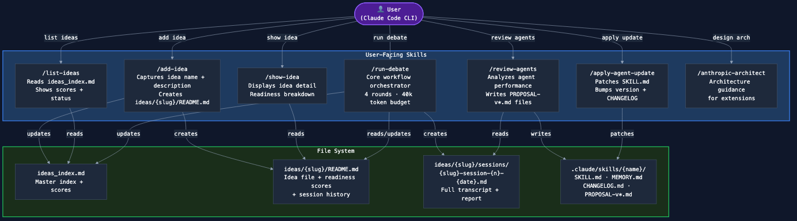
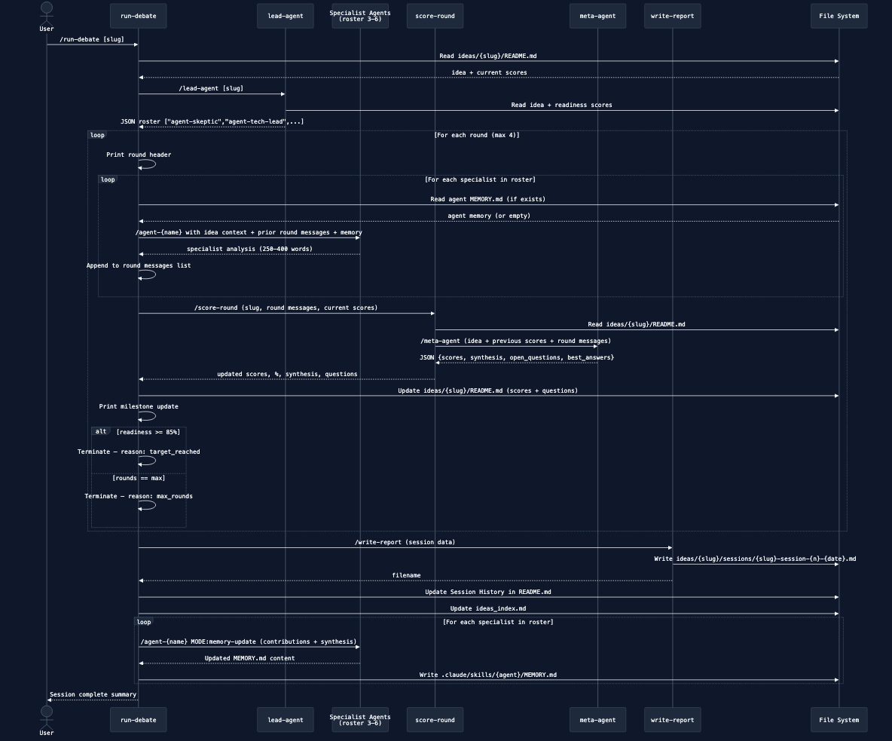
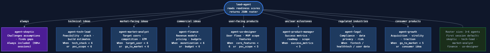
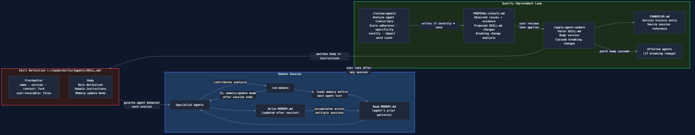

# Agora

Agora is a multi-agent debate system where AI specialists develop raw ideas into fully planned PoC/MVP specs. Users add ideas, trigger debate sessions, and get structured readiness scores across 10 dimensions.



## Quick start

```bash
# Install Claude Code
npm install -g @anthropic-ai/claude-code

# Clone and enter project
cd agora

# Start Claude Code
claude

# Then talk to Claude naturally:
# "Add an idea: a SaaS tool for freelance invoice tracking"
# "Run a debate on my agora idea"
# "Show me my ideas"
```

## Core commands

| What you want | Skill | Natural language |
|---|---|---|
| Add a new idea | `/add-idea [name]` | "Add an idea: [describe it]" |
| Run a debate session | `/run-debate [idea-id]` | "Run a debate on my [name] idea" |
| See all ideas | `/list-ideas` | "Show me my ideas" |
| Inspect an idea | `/show-idea [idea-id]` | "Show me the [name] idea" |
| Continue developing | `/run-debate [idea-id]` | "Continue working on [name]" |
| Review agent performance | `/review-agents [slug]` | "Review agents from the [name] session" |
| Apply an agent improvement | `/apply-agent-update [agent]` | "Apply the [agent-name] update" |
| Design or validate architecture | `/anthropic-architect` | "What architecture should I use for [project/change]?" |

## Readiness score

Every idea is scored across 10 dimensions, each 0–10. The overall readiness percentage is the average. A score of 85%+ means the idea is fully planned and ready to build.

| # | Dimension | What it measures |
|---|---|---|
| 1 | Problem statement | Is the problem clearly defined? |
| 2 | Target user | Is the target persona specific? |
| 3 | Core features | Is the MVP feature set scoped? |
| 4 | Tech stack | Has the technology approach been decided? |
| 5 | Go to market | Is there a concrete first distribution plan? |
| 6 | Key risks | Have main risks been identified and addressed? |
| 7 | PoC scope | Is the minimum provable concept defined? |
| 8 | Success metrics | Are measurable success criteria defined? |
| 9 | Monetization | Is there a revenue model? (N/A for personal/OSS) |
| 10 | Budget estimates | Are rough cost/effort estimates available per phase? |

## How sessions work

1. **Lead agent** reads the idea and selects 3–6 specialist agents best suited to address the current readiness gaps.
2. **Debate rounds** (default: 4) — each specialist analyzes the idea from their perspective, with each agent seeing what others said earlier in the round.
3. **Meta agent** scores all 10 dimensions after each round and produces a synthesis of what was concretely established.
4. **Milestone updates** are printed after each round showing score progress, dimension breakdown, and open questions.
5. **Session report** is written to `ideas/{slug}/sessions/` with the full transcript, final scores, and recommendations for the next session.

Sessions end when max rounds are hit, readiness reaches 85%, or the token budget is exceeded.



## How to extend Agora



**Add a new specialist:** create `.claude/skills/agent-{name}/SKILL.md` with the standard frontmatter:

```yaml
---
name: agent-{name}
description: {role} specialist agent for Agora debate sessions. Invoked by run-debate during active sessions.
user-invocable: false
context: fork
---
```

Then update `.claude/skills/lead-agent/SKILL.md` to include it in the selection rules — otherwise the lead agent will never pick it.

**Add a new workflow:** create `.claude/skills/{workflow-name}/SKILL.md` with a description that triggers on natural language patterns, plus step-by-step instructions in the body.

**Not sure which approach to use?** Run `/anthropic-architect` with a description of what you want to build. It will recommend the right combination of Skills, Agents, and SDK primitives and explain the tradeoffs.

## Improving agents over time

After any debate session, run `/review-agents [slug]` to evaluate each specialist's performance and generate versioned improvement proposals. Then run `/apply-agent-update [agent-name]` to apply a proposal.



For **major** structural changes (output format or schema), both skills now prompt you to validate the new design with `/anthropic-architect` before applying — ensuring structural changes stay consistent with Anthropic architecture best practices.
