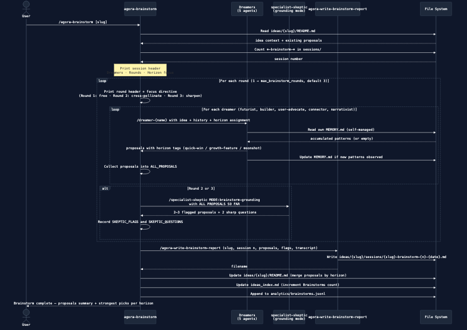

# Agora

Agora is a multi-agent debate system where AI specialists develop raw ideas into fully planned PoC/MVP specs. Users add ideas, trigger debate sessions, and get structured readiness scores across 10 dimensions.


## Quick start

```bash
# Install Claude Code
npm install -g @anthropic-ai/claude-code

# Clone and enter project
cd agora

# Start Claude Code
claude

# Then talk to Claude naturally:
# "Add an idea: a SaaS tool for freelance invoice tracking"
# "Run a debate on my agora idea"
# "Show me my ideas"
```

## Core commands

| What you want | Skill | Natural language |
|---|---|---|
| Add a new idea | `/agora-add-idea [name]` | "Add an idea: [describe it]" |
| Add a constraint to an idea | `/agora-add-constraint [idea-id]` | "Add a constraint to my [name] idea" |
| Brainstorm on an idea | `/agora-brainstorm [idea-id]` | "Brainstorm on my [name] idea" |
| Run a debate session | `/agora-run-debate [idea-id]` | "Run a debate on my [name] idea" |
| See all ideas | `/agora-list-ideas` | "Show me my ideas" |
| Inspect an idea | `/agora-show-idea [idea-id]` | "Show me the [name] idea" |
| Continue developing | `/agora-run-debate [idea-id]` | "Continue working on [name]" |
| Add a note to an idea | `/agora-add-note [idea-id]` | "Add a note to my [name] idea" |
| Review specialist performance | `/agora-review-specialists [slug]` | "Review specialists from the [name] session" |
| See pending improvement proposals | `/agora-list-proposals` | "Show me pending proposals" |
| Apply a specialist improvement | `/agora-apply-specialist-update [specialist]` | "Apply the [specialist-name] update" |
| Analyze session/specialist trends | `/agora-analyze` | "Analyze my sessions" |
| Check if new specialists are needed | `/agora-hire-specialists [slug]` | "Check if we need new specialists" |
| Design or validate architecture | `/knowledge-architect` | "What architecture should I use for [project/change]?" |

## Readiness score

Every idea is scored across 10 dimensions, each 0–10. The overall readiness percentage is the average. A score of 85%+ means the idea is fully planned and ready to build.

| # | Dimension | What it measures |
|---|---|---|
| 1 | Problem statement | Is the problem clearly defined? |
| 2 | Target user | Is the target persona specific? |
| 3 | Core features | Is the MVP feature set scoped? |
| 4 | Tech stack | Has the technology approach been decided? |
| 5 | Go to market | Is there a concrete first distribution plan? |
| 6 | Key risks | Have main risks been identified and addressed? |
| 7 | PoC scope | Is the minimum provable concept defined? |
| 8 | Success metrics | Are measurable success criteria defined? |
| 9 | Monetization | Is there a revenue model? (N/A for personal/OSS) |
| 10 | Budget estimates | Are rough cost/effort estimates available per phase? |

## How adding an idea works

When you run `/agora-add-idea`, the skill asks for a brief description and then sends a single follow-up with 9 targeted questions — one per readiness dimension (problem, users, features, stack, GTM, risks, PoC scope, metrics, monetization, budget). Answer what you know; skip the rest. The README is written with real initial scores for answered dimensions, so debate sessions start with context rather than blanks.

## How brainstorming works

Brainstorm sessions expand an idea's possibility space — generating proposals across three time horizons without affecting readiness scores.

1. **Dreamer roster** — 5 dreamers with complementary generative lenses: Futurist, Builder, User Advocate, Connector, and Narrativist.
2. **Three rounds** — Round 1 is free divergence, Round 2 requires cross-pollinating on each other's proposals, Round 3 fills thin horizons.
3. **Skeptic grounding** — after rounds 2 and 3, the skeptic flags structurally broken proposals and asks two sharp questions.
4. **Proposals organized by horizon** — Quick Wins (0–3 months), Growth Features (3–12 months), Moonshots (1+ year).
5. **Report and proposals** written to `ideas/{slug}/sessions/` and merged into the idea file's `## Proposals` section.

Brainstorming is the right starting point when an idea needs creative expansion; debates are for structural development and readiness scoring.



## How debate sessions work

1. **Lead specialist** reads the idea and selects 3–4 specialists best suited to address the current readiness gaps.
2. **Debate rounds** (2 for ideas with readiness ≥ 30%, 3 for new ideas) — each specialist analyzes the idea from their perspective. Round 1 receives the full idea description; rounds 2+ receive only the previous round's synthesis to reduce token usage.
3. **Scoring** happens after each round across all 10 dimensions, producing a synthesis of what was concretely established.
4. **Milestone updates** are printed after each round showing score progress, dimension breakdown, and open questions.
5. **Session report** is written to `ideas/{slug}/sessions/` with the full transcript, final scores, and recommendations for the next session.

Sessions end when max rounds are hit, readiness reaches 85%, or the token budget is exceeded.

After the session you'll see opt-in prompts for `/agora-review-specialists` and `/agora-hire-specialists` — run them when you want specialist feedback, skip them to save tokens.


## How to extend Agora


**Add a new specialist:** create `.claude/skills/specialist-{name}/SKILL.md` with the standard frontmatter:

```yaml
---
name: specialist-{name}
description: {role} specialist for Agora debate sessions. Invoked by agora-run-debate during active sessions.
user-invocable: false
context: fork
model: sonnet
author: {your name}
version: 1.0.0
---
```

Then update `.claude/skills/agora-lead-specialist/SKILL.md` to include it in the selection rules — otherwise the lead specialist will never pick it.

**Add a new workflow:** create `.claude/skills/{workflow-name}/SKILL.md` with a description that triggers on natural language patterns, plus step-by-step instructions in the body.

**Not sure which approach to use?** Run `/knowledge-architect` with a description of what you want to build. It will recommend the right combination of Skills, Agents, and SDK primitives and explain the tradeoffs.

## Improving agents over time

Run `/agora-review-specialists [slug]` after any session to evaluate each specialist's performance and generate versioned improvement proposals. Then run `/agora-apply-specialist-update [specialist-name]` to apply a proposal. Both are opt-in — you'll see a prompt at the end of each debate session.


For **major** structural changes (output format or schema), both skills now prompt you to validate the new design with `/knowledge-architect` before applying — ensuring structural changes stay consistent with Anthropic architecture best practices.

## Cost optimization

Each skill declares an intended model tier via a `model:` field in its frontmatter (e.g. `model: haiku`, `model: sonnet`). **This field is currently representational — Claude Code does not support per-skill model routing, so all skills run on the active default model.** A mechanism for actual routing is being researched.

Intended model tiers (will take effect once routing is supported):

| Tier | Intended model | Skills |
|---|---|---|
| Helpers | Haiku | `agora-lead-specialist`, `agora-score-round`, `agora-write-report`, `agora-write-brainstorm-report` |
| Specialists & Dreamers | Sonnet | All `specialist-*` (8) and `dreamer-*` (5) agents |
| Orchestrators | Default | `agora-run-debate`, `agora-brainstorm`, review/hire skills |

Token savings already active today:
- **Post-session reviews are opt-in** — skip `/agora-review-specialists` and `/agora-hire-specialists` to save 27K–70K tokens per session.
- **Context trimming in rounds 2+** — specialists receive the round synthesis instead of the full idea description, saving ~500–1,000 tokens per call.
