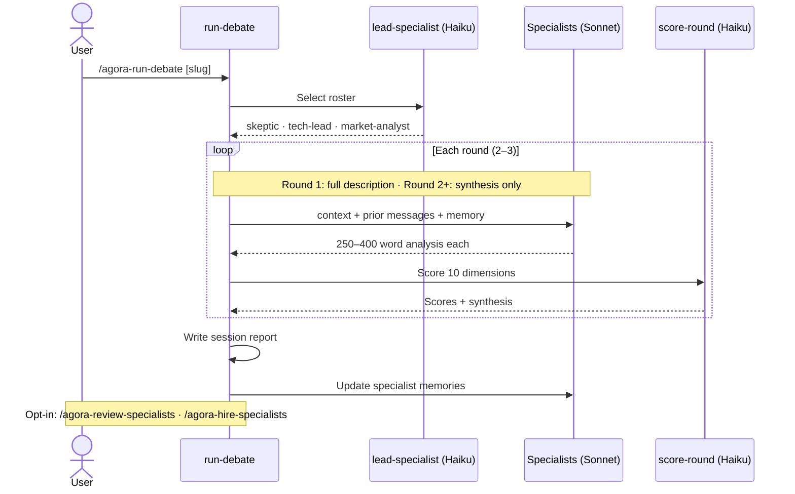
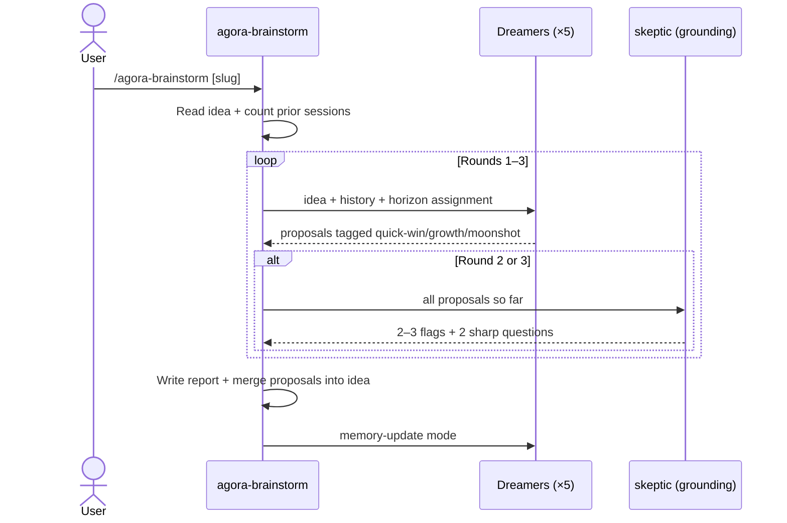
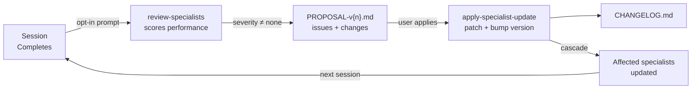

# Agora

**Multi-agent AI debate system for idea development**

Raw concepts → PoC-ready specs, scored across 10 dimensions

<div class="pt-12">
  <span class="px-2 py-1 rounded cursor-pointer" hover="bg-white bg-opacity-10">
    Press <kbd>Space</kbd> to begin →
  </span>
</div>

<!--
Welcome — today I'm walking you through Agora, the multi-agent debate system I built to help develop raw ideas into buildable specs.
-->

---
layout: default
---

# The Problem

<v-clicks>

- **Ideas are multi-dimensional** — they need tech, market, risk, UX, and finance perspectives simultaneously
- **One AI voice isn't enough** — ChatGPT/Claude gives you a single perspective that tends to agree with you
- **Getting from "cool idea" to "here's what to build" is slow and lossy**
- **Structured thinking is hard to force yourself to do alone**

</v-clicks>

<v-click>

### What if you could summon a team of expert critics for any idea in seconds?

</v-click>

<!--
The core problem: taking a rough idea and turning it into something you can actually build requires many different lenses. Most AI tools give you one voice. Agora gives you a debate.
-->

---
layout: two-cols
---

# What is Agora?

A **Claude Code skill system** where AI specialists with different goals debate your idea across multiple rounds.

**Each session:**
- 3–4 specialists are selected for the idea's gaps
- They argue, challenge, and build on each other
- A meta-specialist scores 10 readiness dimensions after each round
- Session ends when the idea is ready (≥85%) or rounds are exhausted

**Output:**
- A scored idea file with open questions resolved
- A full session transcript + report
- Persistent specialist memories for the next session

::right::

<div class="ml-4 mt-4">

```
ideas/
  agora/
    README.md          ← idea + scores
    sessions/
      agora-session-1-20260508.md

.claude/skills/
  agora-add-idea/      ← structured intake
  agora-add-constraint/
  agora-run-debate/    ← orchestrator
  agora-lead-specialist/
  specialist-skeptic/
  specialist-tech-lead/
  ...
```

</div>

<!--
Agora lives entirely inside Claude Code as a set of skills. No servers, no APIs beyond Claude itself. Everything is markdown files on disk.
-->

---
layout: center
class: text-center
---

# Two Modes

<div class="grid grid-cols-2 gap-8 mt-8 text-left max-w-3xl mx-auto">

<div class="border border-green-400 rounded-lg p-5">
  <div class="text-lg font-bold text-green-400 mb-2">Brainstorm</div>
  <code class="text-sm">"Brainstorm on my invoice idea"</code>
  <div class="text-sm mt-3 text-gray-400">5 dreamers generate proposals across 3 rounds. Organized by horizon: Quick Wins · Growth Features · Moonshots. <strong class="text-gray-300">Expands possibility space — no readiness scoring.</strong></div>
</div>

<div class="border border-purple-400 rounded-lg p-5">
  <div class="text-lg font-bold text-purple-400 mb-2">Debate</div>
  <code class="text-sm">"Run a debate on my invoice idea"</code>
  <div class="text-sm mt-3 text-gray-400">3–4 specialists argue across 2–3 rounds. Meta-specialist scores 10 dimensions after each round. <strong class="text-gray-300">Develops a direction — drives readiness scores.</strong></div>
</div>

</div>

<div class="mt-8 text-sm text-gray-500">Brainstorm first to explore. Debate to build.</div>

---
layout: center
class: text-center
---

# Three Steps

<div class="grid grid-cols-3 gap-8 mt-8 text-left">

<div class="border border-blue-400 rounded-lg p-4">
  <div class="text-3xl mb-2">1</div>
  <div class="font-bold text-blue-400 mb-2">Add an Idea</div>
  <code class="text-sm">"Add an idea: SaaS invoice tool for freelancers"</code>
  <div class="text-sm mt-2 text-gray-400">Asks 9 targeted questions, then writes ideas/{slug}/README.md with initial scores already filled in</div>
</div>

<div class="border border-purple-400 rounded-lg p-4">
  <div class="text-3xl mb-2">2</div>
  <div class="font-bold text-purple-400 mb-2">Run a Debate</div>
  <code class="text-sm">"Run a debate on my invoice idea"</code>
  <div class="text-sm mt-2 text-gray-400">Specialists debate 2–3 rounds, scored after each</div>
</div>

<div class="border border-green-400 rounded-lg p-4">
  <div class="text-3xl mb-2">3</div>
  <div class="font-bold text-green-400 mb-2">Read the Report</div>
  <code class="text-sm">"Show me my invoice idea"</code>
  <div class="text-sm mt-2 text-gray-400">Readiness score, synthesis, open questions, next steps</div>
</div>

</div>

---
layout: two-cols
---

# Idea Constraints

Before running a debate, you can set **hard requirements** the specialists must respect:

<div class="text-sm mt-3">

```bash
"Add a constraint to my invoice idea"
# → What is the constraint?
# Must use Next.js + Supabase
# → Rationale?
# Team already knows these tools
```

Stored in `## Constraints` in the idea file:

| Constraint | Rationale |
|---|---|
| Must use Next.js + Supabase | Team expertise |
| PoC budget ≤ $500 | Bootstrapped |

</div>

::right::

<div class="ml-4 text-sm">

<v-click>

**During the debate:**
- Every specialist receives `[CONSTRAINTS]` in their context
- They operate within constraints by default
- Overriding requires an explicit marker:

```
⚠ CONSTRAINT OVERRIDE: "Must use Next.js"
— Vue.js would cut PoC time by 3 weeks
  given the data-binding complexity here
```

</v-click>

<v-click>

**Override proposals are:**
- Surfaced in the round synthesis
- Logged in the session report
- Never silent — always explicitly flagged

</v-click>

</div>

---

# Debate Session Flow



<!--
The key design: each specialist sees what others said earlier in the round, so they can challenge and build on each other — not just talk past each other.
-->

---
layout: two-cols
---

# Brainstorm Session Flow



<!--
Key difference from debate: dreamers generate divergently. The skeptic grounds, not dominates.
Round 2 forces cross-pollination — each dreamer must build on someone else's proposal.
-->

---
layout: two-cols
---

# The Dreamer Roster

<div class="text-sm">

| Dreamer | Lens | Focus |
|---|---|---|
| **Futurist** | 10-year horizon | Emerging tech, paradigm shifts, moonshots |
| **Builder** | Execution-first | What can ship in a sprint, technical feasibility |
| **User Advocate** | Human-centered | Jobs-to-be-done, friction, delight |
| **Connector** | Cross-domain | Analogies from other industries, unexpected pairings |
| **Narrativist** | Story-first | Positioning, naming, why it sticks |

</div>

::right::

<div class="ml-4 mt-2 text-sm">

**All 5 dreamers run every session** — no roster selection.

Proposals are tagged by time horizon:

<v-click>

```
Quick Wins (0–3 months)
  — shippable in a sprint, low risk

Growth Features (3–12 months)
  — meaningful differentiation

Moonshots (1+ year)
  — high risk, high reward, track for later
```

</v-click>

<v-click>

Round 2: each dreamer **must build on** another's proposal.  
Round 3: dreamers **fill the thinnest horizon**.

Skeptic flags broken proposals after rounds 2 and 3 — no veto power, just signal.

</v-click>

</div>

---
layout: two-cols
---

# The Specialist Roster

<div class="text-sm">

| Specialist | When Selected |
|---|---|
| **skeptic** | Always |
| **tech-lead** | tech_stack < 6 or poc_scope < 6 |
| **market-analyst** | target_user < 6 or go_to_market < 6 |
| **finance** | monetization < 6 or budget < 6 |
| **ux-designer** | core_features < 6 or poc_scope < 5 |
| **product-manager** | success_metrics < 5 |
| **legal** | fintech / healthtech / user data |
| **growth** | go_to_market < 5 or consumer idea |

</div>

::right::

<div class="ml-4 mt-2 text-sm">

<v-click>

**Roster size: 3–4 specialists**

The lead specialist reads readiness scores and picks the team for this idea's specific gaps.

**Default:** skeptic · tech-lead · market-analyst

**Later sessions:** gaps drive swaps — if tech is solved, ux-designer or finance steps in.

</v-click>

<v-click>

> Specialist memories persist across sessions — analysis gets richer over time automatically.

</v-click>

</div>

---

# Readiness Score — 10 Dimensions

Each dimension is scored **0–10**. Overall readiness = average × 10%.  
**≥85% means the idea is ready to build.**

<div class="grid grid-cols-2 gap-x-8 mt-4 text-sm">

<div>

| # | Dimension | What it measures |
|---|---|---|
| 1 | Problem statement | Is the problem clearly defined? |
| 2 | Target user | Is the persona specific? |
| 3 | Core features | Is the MVP scoped? |
| 4 | Tech stack | Has the approach been decided? |
| 5 | Go to market | Is there a concrete GTM plan? |

</div>

<div>

| # | Dimension | What it measures |
|---|---|---|
| 6 | Key risks | Have risks been addressed? |
| 7 | PoC scope | Is the minimum provable concept defined? |
| 8 | Success metrics | Are measurable criteria defined? |
| 9 | Monetization | Is there a revenue model? |
| 10 | Budget estimates | Are cost/effort estimates available? |

</div>

</div>

<v-click>

<div class="mt-6 border border-green-500 rounded p-3 text-sm bg-green-900 bg-opacity-20">

**Current ideas:** Agora (85% ✓ ready) · Flavor Graph (77% — 1 more session needed)

</div>

</v-click>

<!--
The scoring happens after every round so you can watch the idea develop in real time. The meta-specialist also writes a synthesis and flags open questions still unresolved.
-->

---
layout: two-cols
---

# Session Termination Rules

A session ends when the **first** of these is hit:

<v-clicks>

**1. Readiness target reached**  
Default: 85% — the idea is fully planned

**2. Max rounds reached**  
- New ideas (score < 30%): **3 rounds**
- Partial ideas (score ≥ 30%): **2 rounds**

**3. Token budget exceeded**  
Default: 40,000 tokens per session

</v-clicks>

::right::

<div class="ml-4 mt-2 text-sm">

<v-click>

**Defaults — override in the idea file:**

```yaml
max_roster_size: 4      # specialists per session
max_rounds: 3           # new ideas (< 30%)
max_rounds_partial: 2   # partial ideas (≥ 30%)
readiness_target: 85%
token_budget: 40,000

# Override example:
# ## Session overrides
# max_rounds: 5
# readiness_target: 75%
```

</v-click>

</div>

---
layout: two-cols
---

# Key Commands

**Natural language** — Claude picks the right skill:

```bash
"Add an idea: [describe it]"
"Add a constraint to my [name] idea"
"Brainstorm on my [name] idea"
"Run a debate on my [name] idea"
"Show me my ideas"
"Show me the [name] idea"
```

**Slash commands:**

```bash
/agora-add-idea [name]
/agora-add-constraint [idea-id]
/agora-brainstorm [idea-id]
/agora-run-debate [idea-id]
/agora-list-ideas
/agora-show-idea [idea-id]
/agora-add-note [idea-id]
```

::right::

<div class="ml-4">

**Improvement pipeline:**

```bash
# After any session
/agora-review-specialists [slug]
/agora-list-proposals
/agora-apply-specialist-update [name]
/agora-analyze
/agora-hire-specialists [slug]
```

<v-click>

**Advanced:**

```bash
/knowledge-architect   # pick the right architecture
/agora-build-specialist [slug]
```

</v-click>

</div>

---
layout: two-cols
---

# Extending Agora

<div class="text-sm">

### Add a new specialist

Create `.claude/skills/specialist-{name}/SKILL.md`:

```yaml
---
name: specialist-{name}
description: {Role} specialist for Agora.
user-invocable: false
context: fork
model: sonnet
author: {your name}
version: 1.0.0
---
```

Then add selection rules to `agora-lead-specialist/SKILL.md`.

</div>

::right::

<div class="ml-4 text-sm">

### Add a new workflow

Create `.claude/skills/{workflow}/SKILL.md` with a description and step-by-step instructions.

<v-click>

### Not sure which approach?

```bash
/knowledge-architect
```

Recommends the right mix of Skills, Agents, and Anthropic SDK primitives.

</v-click>

<v-click>

> All logic lives in Markdown — nothing to compile or deploy.

</v-click>

</div>

---

# Continuous Improvement Loop

**Specialist memories** accumulate automatically after every session — no manual work needed.

<div class="mt-2">



</div>

---
layout: two-cols
---

# Specialist Validation

Run `/agora-review-specialists` after any session to score each specialist (opt-in — prompted at session end):

<div class="text-sm mt-2">

| Criterion | What it checks |
|---|---|
| **Adherence** | Followed their stated role and output structure? |
| **Specificity** | Named real tools, numbers, companies — not vague? |
| **Novelty** | Added new info each round, not repeated? |
| **Responsiveness** | Built on what other specialists said? |
| **Impact** | Raised any readiness dimension score? |
| **Word count** | Stayed within 250–400 words? |

</div>

::right::

<div class="ml-4 text-sm">

**Severity assigned per specialist:**

- `none` — performed as expected, no action needed
- `minor` — small wording or example fix
- `moderate` — behavior gap, not following instructions consistently
- `major` — consistent underperformance across rounds

<v-click>

**Version bump type:**

- `patch` — wording fix, no behavior change
- `minor` — behavior change, output format unchanged
- `major` — output format change (cascades to callers)

Analytics written to `analytics/specialists.jsonl` after every review.

</v-click>

</div>

---
layout: two-cols
---

# Improvement Proposals

For each specialist with severity ≠ `none`, a proposal file is written:

<div class="text-sm mt-2">

```yaml
specialist: specialist-tech-lead
current-version: 1.2.0
proposed-version: 1.3.0
change-type: minor
status: pending
```

Contains:
- **Observed issues** with evidence (round + quote)
- **Proposed SKILL.md changes** (current → new text)
- **Breaking change analysis** and affected specialists

</div>

::right::

<div class="ml-4 text-sm">

<v-click>

**Applying a proposal** (`/agora-apply-specialist-update`):

1. Validates skill version matches the proposal
2. Applies each text change to SKILL.md
3. Bumps version in frontmatter
4. If breaking → cascades a patch to affected specialists
5. Marks proposal `status: applied`
6. Writes CHANGELOG entry

</v-click>

<v-click>

> Major changes prompt a `/knowledge-architect` review before applying.

`/agora-list-proposals` ranks all pending proposals by estimated impact.

</v-click>

</div>

---
layout: two-cols
---

# Hiring New Specialists

`/agora-hire-specialists` scans a session for coverage gaps:

<div class="text-sm mt-2">

- Open questions no specialist addressed
- Dimensions still below 5/10 after all rounds
- Moments where specialists flagged missing expertise

**Two mandatory filters (both must pass):**

**Filter 1 — Session impact:** Would this specialist materially change the next session's outcome?

**Filter 2 — Reusability:** Would >50% of future ideas benefit from this specialist?

If either fails, no job-post is written.

</div>

::right::

<div class="ml-4 text-sm">

<v-click>

**If approved:** writes `job-posts/specialist-{slug}.md`

**Then `/agora-build-specialist`:**

1. Runs 4 targeted web searches on the domain
2. Fetches 4–6 credible sources
3. Synthesizes frameworks, failure modes, benchmarks
4. Writes the SKILL.md with research-grounded instructions
5. Optionally writes reference files for complex domains
6. Registers the specialist in the lead-specialist roster
7. Marks the job-post as `built`

</v-click>

<v-click>

> The new specialist is available for the very next session.

</v-click>

</div>

---
layout: two-cols
---

# Cost Optimization

Each skill declares an **intended model tier** via `model:` in frontmatter.

> ⚠ Claude Code does not currently support per-skill model routing — the field is representational. A routing mechanism is being researched.

<div class="text-sm mt-3">

| Tier | Intended model | Skills |
|---|---|---|
| Helpers | **Haiku** | lead-specialist · score-round · write-report |
| Agents | **Sonnet** | all 8 specialists · all 5 dreamers |
| Orchestrators | **Default** | run-debate · brainstorm · review · hire |

</div>

::right::

<div class="ml-4 text-sm">

**Token savings active today:**

<v-click>

- Post-session reviews are **opt-in** — skip `/agora-review-specialists` and `/agora-hire-specialists` to save 27K–70K tokens per session.

- **Context trimming** — specialists in rounds 2+ receive only the previous round's synthesis (~500–1,000 tokens saved per call).

</v-click>

<v-click>

Once routing is supported, helpers drop to Haiku and specialist calls drop to Sonnet — the biggest cost drivers in any session.

</v-click>

</div>

---
layout: two-cols
---

# File Structure

<div class="text-xs">

```
agora/
├── ideas_index.md        ← master index + scores
├── ideas/{slug}/
│   ├── README.md         ← idea + readiness scores + proposals
│   └── sessions/
│       ├── {slug}-session-{n}-{date}.md      ← debate report
│       └── {slug}-brainstorm-{n}-{date}.md   ← brainstorm report
├── .claude/skills/
│   ├── agora-run-debate/    ← debate orchestrator
│   ├── agora-brainstorm/    ← brainstorm orchestrator
│   ├── agora-lead-specialist/
│   ├── specialist-{name}/   ← debate specialists
│   │   ├── SKILL.md · MEMORY.md · CHANGELOG.md
│   └── dreamer-{name}/      ← brainstorm dreamers
│       └── SKILL.md · MEMORY.md
└── analytics/
    ├── sessions.jsonl        ← debate KPIs
    ├── specialists.jsonl     ← specialist performance
    └── brainstorms.jsonl     ← brainstorm stats
```

</div>

::right::

<div class="ml-4 mt-2">

<v-click>

**Everything is plain text.** No database, no server.

Each idea file tracks its own readiness scores, session history, and open questions inline.

</v-click>

<v-click>

**Specialist skill files** contain:
- Their role definition and debate instructions
- A memory file updated after every session
- A changelog of improvements applied
- Pending proposal files awaiting review

</v-click>

</div>

---
layout: center
class: text-center
---

# Current Ideas

<div class="grid grid-cols-2 gap-8 mt-8 text-left mx-auto max-w-2xl">

<div class="border border-green-400 rounded-lg p-5">
  <div class="text-xl font-bold text-green-400 mb-1">Agora</div>
  <div class="text-4xl font-mono font-bold mb-2">85%</div>
  <div class="text-sm text-gray-400">1 session · Ready to build ✓</div>
  <div class="mt-3 text-xs text-gray-500">This project — self-referential!</div>
</div>

<div class="border border-yellow-400 rounded-lg p-5">
  <div class="text-xl font-bold text-yellow-400 mb-1">Flavor Graph</div>
  <div class="text-4xl font-mono font-bold mb-2">77%</div>
  <div class="text-sm text-gray-400">1 session · ~1 more session to target</div>
  <div class="mt-3 text-xs text-gray-500">Graph-based flavor pairing discovery tool</div>
</div>

</div>

---
layout: end
---

# That's Agora

**Multi-agent brainstorming + debate → structured specs → ideas you can actually build**

<div class="mt-8 text-sm text-gray-400">

- Natural language interface via Claude Code  
- 5 dreamers for creative expansion (brainstorm mode)  
- 8 specialists, self-selected per idea (debate mode)  
- 10-dimension readiness scoring  
- Proposals organized by time horizon  
- Persistent memories for both dreamers and specialists  
- Continuous improvement loop  

</div>

<div class="mt-8">

```bash
cd agora && claude
# "Brainstorm on my ... idea"      ← explore possibility space
# "Run a debate on my ... idea"    ← develop and score
```

</div>
