# Architecture

## System Overview

Agora is built on three primitives from Claude Code:

| Primitive | Role in Agora |
|---|---|
| **Skills** (`.claude/skills/*/SKILL.md`) | Orchestrators — they define workflows, invoke agents, manage state, write files |
| **Agents** (`.claude/agents/*.md`) | Workers — each has a persona, role, output format, and optional persistent memory |
| **Markdown files** | All persistent state — ideas, sessions, analytics, proposals, changelogs |

There is no runtime process, no database, no server. The Claude Code session is the runtime.

---

## High-Level Component Diagram

```mermaid
graph TD
    User["User (Claude Code session)"]

    subgraph Skills["Skills — Orchestration Layer"]
        AddIdea["agora-add-idea"]
        RunDebate["agora-run-debate"]
        Brainstorm["agora-brainstorm"]
        ReviewSpec["agora-review-specialists"]
        ApplyUpdate["agora-apply-specialist-update"]
        ListProps["agora-list-proposals"]
        Analyze["agora-analyze"]
        Hire["agora-hire-specialists"]
        Build["agora-build-specialist"]
    end

    subgraph SubSkills["Sub-Skills (internal, not user-invocable)"]
        LeadSpec["agora-lead-specialist"]
        ScoreRound["agora-score-round"]
        WriteReport["agora-write-report"]
        WriteBrainstorm["agora-write-brainstorm-report"]
    end

    subgraph DebateAgents["Debate Specialists"]
        Skeptic["specialist-skeptic (Opus 4.7)"]
        TechLead["specialist-tech-lead (Opus 4.7)"]
        Legal["specialist-legal (Opus 4.7)"]
        Finance["specialist-finance (Sonnet 4.6)"]
        Growth["specialist-growth (Sonnet 4.6)"]
        Market["specialist-market-analyst (Sonnet 4.6)"]
        PM["specialist-product-manager (Sonnet 4.6)"]
        UX["specialist-ux-designer (Sonnet 4.6)"]
    end

    subgraph DreamAgents["Brainstorm Dreamers"]
        Futurist["dreamer-futurist (Opus 4.7)"]
        Builder["dreamer-builder (Haiku 4.5)"]
        UserAdv["dreamer-user-advocate (Sonnet 4.6)"]
        Connector["dreamer-connector (Sonnet 4.6)"]
        Narrativist["dreamer-narrativist (Sonnet 4.6)"]
    end

    subgraph State["State (Markdown + JSONL files)"]
        Ideas["ideas/{slug}/README.md"]
        Index["ideas_index.md"]
        Sessions["ideas/{slug}/sessions/*.md"]
        Analytics["analytics/*.jsonl"]
        AgentMemory[".claude/agents/*/MEMORY.md"]
        Proposals[".claude/agents/*/PROPOSAL-v*.md"]
        Changelogs[".claude/agents/*/CHANGELOG.md"]
        JobPosts["job-posts/*.md"]
    end

    User --> Skills
    RunDebate --> LeadSpec
    RunDebate --> ScoreRound
    RunDebate --> WriteReport
    RunDebate --> DebateAgents
    Brainstorm --> DreamAgents
    Brainstorm --> Skeptic
    Brainstorm --> WriteBrainstorm
    ReviewSpec --> Proposals
    ApplyUpdate --> Changelogs
    Hire --> JobPosts
    Build --> DebateAgents

    Skills --> State
    SubSkills --> State
    DebateAgents --> AgentMemory
    DreamAgents --> AgentMemory
```



---

## Execution Model

### Skills as Workflows

A Skill is a Markdown file with YAML frontmatter and an instruction body. When a user triggers a skill (by slash command or natural language), Claude Code's active session reads the skill file and follows its instructions step by step. Skills can:

- Read and write files
- Invoke agents via the `Agent` tool
- Invoke other skills via the `Skill` tool
- Run shell commands via `Bash`
- Append to analytics files

Skills are **synchronous from the user's perspective** — the session executes them top-to-bottom. The only parallelism is when a skill explicitly issues multiple `Agent` calls in the same message (as `agora-brainstorm` does for dreamers).

### Agents as Workers

An Agent is a Markdown file with YAML frontmatter and a system-prompt body. When invoked, Claude Code spawns a subagent with that system prompt and the provided input. Agents:

- Receive structured context (idea, prior round messages, constraints)
- Produce a text response following their role's format
- Optionally read/write their own `MEMORY.md` file to accumulate cross-session patterns
- Do not retain state between invocations except through their memory file

### Information Flow in a Debate Round

```
agora-run-debate
│
├─ reads: ideas/{slug}/README.md  (full idea + scores + constraints)
│
├─ invokes: agora-lead-specialist
│   └─ returns: JSON array of specialist names
│
└─ for each round:
    ├─ specialist-1 receives: [CONSTRAINTS] + [IDEA] + [PRIOR ROUNDS] + [THIS ROUND SO FAR: none]
    │   └─ returns: response text
    │
    ├─ specialist-2 receives: [CONSTRAINTS] + [IDEA] + [PRIOR ROUNDS] + [THIS ROUND SO FAR: specialist-1 response]
    │   └─ returns: response text
    │
    ├─ specialist-N receives: [CONSTRAINTS] + [IDEA] + [PRIOR ROUNDS] + [THIS ROUND SO FAR: all previous]
    │   └─ returns: response text
    │
    └─ agora-score-round receives: all round messages + current scores
        └─ returns: JSON with new scores + synthesis paragraph
```

After round 1, the full idea description is replaced by the `synthesis` from `agora-score-round` for all subsequent rounds — this is the primary token-reduction mechanism.

---

## File System as Database

All persistent state lives in the file system. There is no database. The schema is enforced by convention in the skill files.

```
agora/
├── ideas/
│   └── {slug}/
│       ├── README.md          ← canonical idea state
│       └── sessions/
│           ├── {slug}-session-{n}-{YYYYMMDD}.md
│           └── {slug}-brainstorm-{n}-{YYYYMMDD}.md
├── ideas_index.md              ← master index (score, status, session count)
├── analytics/
│   ├── sessions.jsonl          ← one record per debate session
│   ├── specialists.jsonl       ← one record per specialist per session
│   ├── brainstorms.jsonl       ← one record per brainstorm session
│   └── dreamers.jsonl          ← one record per dreamer per brainstorm
├── job-posts/
│   └── {role-slug}.md          ← generated specialist job descriptions
└── .claude/
    ├── agents/
    │   ├── {agent-name}.md                ← agent definition + system prompt
    │   └── {agent-name}/
    │       ├── MEMORY.md                  ← accumulated cross-session patterns
    │       ├── PROPOSAL-v{ver}.md         ← pending/applied improvement proposals
    │       └── CHANGELOG.md               ← version history
    └── skills/
        └── {skill-name}/
            └── SKILL.md                   ← skill definition + workflow instructions
```

---

## Model Routing

Agents declare their intended model in YAML frontmatter. Claude Code routes subagent calls to the specified model.

| Model | Assigned to | Rationale |
|---|---|---|
| `claude-opus-4-7` | dreamer-futurist, specialist-skeptic, specialist-tech-lead, specialist-legal | Highest reasoning quality needed for deep critique, technical assessment, legal analysis, and long-horizon extrapolation |
| `claude-sonnet-4-6` | dreamer-connector, dreamer-narrativist, dreamer-user-advocate, specialist-finance, specialist-growth, specialist-market-analyst, specialist-product-manager, specialist-ux-designer | Strong capability at lower cost for domain specialist roles |
| `claude-haiku-4-5-20251001` | dreamer-builder | Lightweight; Builder's task is mechanical (smallest buildable version) not deep reasoning |

Skills do not support per-skill model routing — all skills run on the active session model. The `model:` field in skill frontmatter is representational only (documents intent, not enforced).

---

## Session Configuration

Session behavior is governed by defaults in `CLAUDE.md` and can be overridden per-idea by adding a `## Session overrides` section to that idea's README with `key: value` pairs.

| Setting | Default | Override key |
|---|---|---|
| Max specialists per session | 4 | `max_roster_size` |
| Max rounds (new idea) | 3 | `max_rounds` |
| Max rounds (partial idea) | 2 | `max_rounds_partial` |
| Max brainstorm rounds | 3 | `max_brainstorm_rounds` |
| Readiness target | 85% | `readiness_target` |

---

## Constraint System

Constraints are hard requirements specialists must respect during all sessions. They live in the `## Constraints` table of an idea's README:

```markdown
## Constraints

| Constraint | Rationale |
|---|---|
| Must use FastAPI + Pydantic AI | Backend tech is decided |
| Budget ceiling $5K total | Bootstrapped project |
```

Each specialist receives constraints as a formatted `[CONSTRAINTS]` block at the top of their prompt. Specialists must operate within constraints and may only propose overriding them with the explicit marker:

```
⚠ CONSTRAINT OVERRIDE: "{constraint text}" — {one sentence justification}
```

The lead specialist (`agora-lead-specialist`) also receives constraints to factor them into roster selection.

---

## Agent Memory System

Each agent has a persistent `MEMORY.md` file in its agent folder. After every session, an agent reads this file at the start of its turn and writes updated patterns at the end. Memory is:

- **Cross-session** — persists across all future sessions
- **Cross-idea** — not idea-specific (idea data lives in `ideas/{slug}/`)
- **Agent-curated** — the agent decides what to keep, merge, strengthen, revise, or remove
- **Concise by design** — agents compress rather than accumulate noise

Memory gives agents long-term improvement without changing their base definition. A Tech Lead who has seen many sessions will have accumulated knowledge about which effort estimates are systematically wrong, which tech choices are over-engineered for PoCs, etc.
