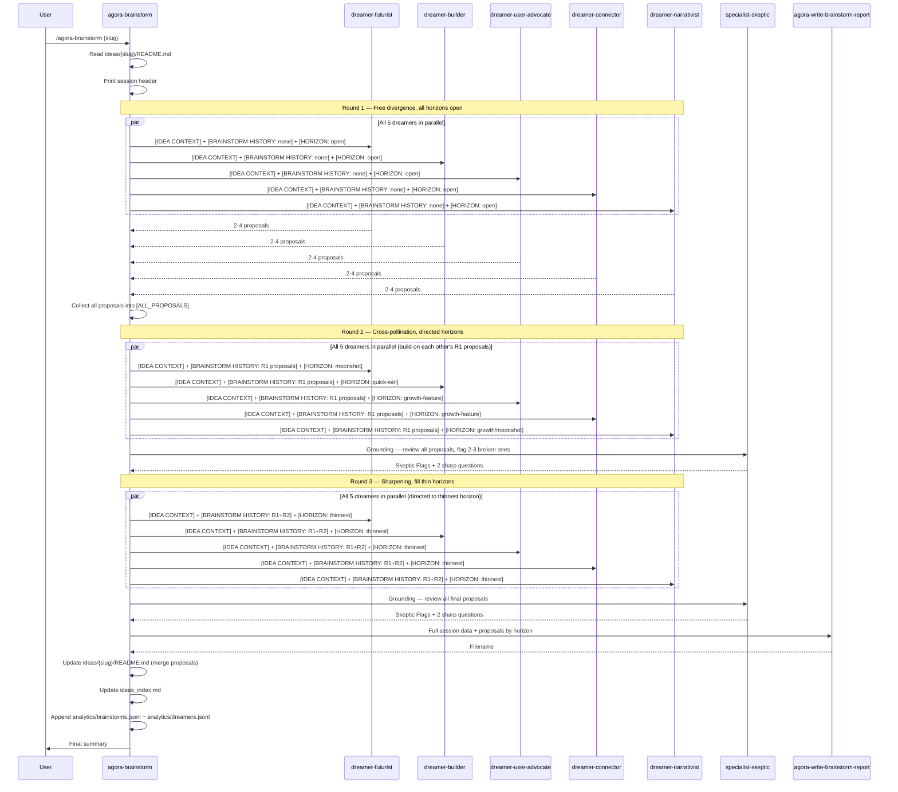

# Workflow: Brainstorm Session

A brainstorm session is triggered by `agora-brainstorm`. It expands an idea's possibility space by generating proposals across three time horizons. Unlike debate sessions, brainstorms do **not** affect readiness scores — they produce a set of proposals organized by horizon.

---

## When to Use

- **Use brainstorm** when an idea needs creative expansion and new directions before structural development
- **Use debate** (not brainstorm) when the idea already has direction and needs planning, scoring, and decisions
- Brainstorms are also useful mid-development to explore a specific dimension (e.g., GTM options)

---

## Session Flow Diagram



---

## Dreamer Prompt Structure

Each dreamer receives the same structure:

```
[IDEA CONTEXT]
Name: {idea name}
Description: {full description}
Open questions: {list}
{If existing proposals: "Existing proposals: {count} already recorded — do not repeat."}

[BRAINSTORM HISTORY]
{All proposals from PREVIOUS completed rounds, as a list.
 If Round 1: "None — this is the first round."}

[HORIZON ASSIGNMENT]
{This dreamer's horizon directive for this round}

Round {n} of {max_brainstorm_rounds}.
{Round 2+: "You must explicitly build on or fork at least one proposal from another dreamer in [BRAINSTORM HISTORY]."}
```

---

## Dreamer Output Format

Each dreamer outputs 2–4 proposals in this exact format:

```
[HORIZON: quick-win | growth-feature | moonshot]
**{Proposal title — 3–6 words}**
{2–3 sentences: what it is, why it fits this idea's direction, what makes it possible.}
```

---

## Horizon Assignments by Round

| Dreamer | Round 1 | Round 2 | Round 3 |
|---|---|---|---|
| dreamer-futurist | All open | moonshot | Thinnest horizon |
| dreamer-builder | All open | quick-win | Thinnest horizon |
| dreamer-user-advocate | All open | growth-feature | Thinnest horizon |
| dreamer-connector | All open | growth-feature | Thinnest horizon |
| dreamer-narrativist | All open | growth-feature or moonshot | Thinnest horizon |

"Thinnest horizon" in Round 3 = whichever of quick-win / growth-feature / moonshot has the fewest proposals so far.

---

## Cross-Pollination Rule

In Round 2 and beyond, every dreamer **must** explicitly build on or fork at least one proposal from another dreamer in `[BRAINSTORM HISTORY]`. This prevents the dreamers from generating disconnected proposals and creates a genuine collaborative evolution of ideas.

Cross-pollination happens **between rounds**, not within a round. All 5 dreamers in a given round run in parallel and do not see each other's responses from that round.

---

## Skeptic Grounding

After rounds 2 and 3 (but **not** Round 1), the Skeptic reviews all proposals generated so far in grounding mode:

**Input to Skeptic:**
```
MODE: brainstorm-grounding

[IDEA CONTEXT]
Name: {idea name}
Description: {description}

[ALL PROPOSALS SO FAR]
{full list}

You are grounding a brainstorm session, not challenging the original idea.
Review the proposals above. Flag 2–3 that are structurally broken, already exist as products,
or depend on a false premise. Give one sentence per flag.
End with exactly 2 sharp questions about the most fragile proposals.
```

**Skeptic Output Format:**
```
Skeptic Flags:
- **{Proposal title}**: {one sentence reason it's broken/exists/false premise}

Questions:
1. {question?}
2. {question?}
```

Flagged proposals and questions are recorded in the session report but do not remove proposals from the output — the user decides what to act on.

---

## Brainstorm Report Structure

Written to `ideas/{slug}/sessions/{slug}-brainstorm-{n}-{YYYYMMDD}.md`:

```markdown
# {Idea Name} — Brainstorm Session {n}

**Date:** {YYYY-MM-DD}
**Dreamers:** The Futurist · The Builder · The User Advocate · The Connector · The Narrativist
**Rounds:** 3
**Proposals generated:** {total}

## Proposals by Horizon

### Quick Wins (0–3 months)
{proposals with dreamer attribution and round number}

### Growth Features (3–12 months)
{proposals}

### Moonshots (1+ year)
{proposals}

## Skeptic Grounding

### After Round 2
Skeptic Flags:
{flags}
Questions: {2 questions}

### After Round 3
Skeptic Flags:
{flags}
Questions: {2 questions}

## Full Transcript

### Round 1
┌─ The Futurist ─...
│ {full response}
└─...
{all 5 dreamers}

### Round 2
...

### Round 3
...
```

---

## Proposals Merged into Idea README

After the session, proposals are merged into the idea's `## Proposals` section:

```markdown
## Proposals

*Last updated: {YYYY-MM-DD} (Brainstorm Session {n})*

### Quick Wins (0–3 months)
- **{title}** (Session {n}): {1-sentence description}

### Growth Features (3–12 months)
- **{title}** (Session {n}): {1-sentence description}

### Moonshots (1+ year)
- **{title}** (Session {n}): {1-sentence description}
```

Existing proposals are never deleted — new proposals are appended with a session tag.

---

## Key Differences from Debate Sessions

| Aspect | Debate | Brainstorm |
|---|---|---|
| Agent execution | Sequential (each sees prior) | Parallel (all 5 at once) |
| Affects readiness score | Yes | No |
| Purpose | Develop and plan | Expand and explore |
| Output | Session report with scores | Proposals by horizon |
| Skeptic role | Main critic in every round | Grounding check after rounds 2–3 |
| Max rounds | 2–3 (adaptive) | Always 3 |
| Early termination | Yes (85% readiness) | No |
| Analytics written | `sessions.jsonl` + `specialists.jsonl` | `brainstorms.jsonl` + `dreamers.jsonl` |
