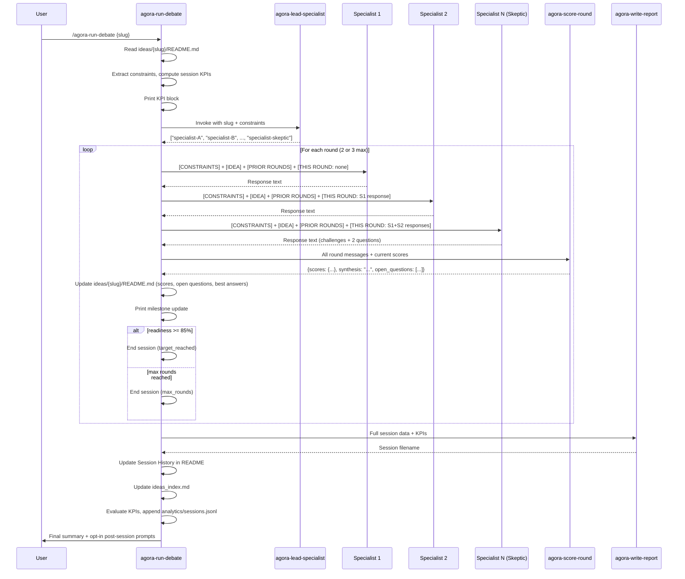

# Workflow: Debate Session

A debate session is triggered by `agora-run-debate`. It selects a specialist roster, runs 2–3 rounds of sequential debate, scores after each round, and produces a structured session report.

---

## When to Use

- **Use debate** when an idea needs structural development — sharper problem definition, tech feasibility, GTM, monetization, risk analysis, scoping
- **Use brainstorm** (not debate) when an idea needs creative expansion and new directions first
- Typical path: brainstorm first to expand possibility space, then debate to narrow and plan

---

## Session Flow Diagram



---

## Specialist Prompt Structure

Each specialist receives the following context, which changes between Round 1 and Round 2+:

### Round 1

```
[CONSTRAINTS]
• {constraint} (Rationale: {rationale})
• ...

[IDEA]
{idea name}

{full description}

Current readiness: {overall}%
Breakdown:
| Dimension | Score |
| problem_statement | 6/10 |
| target_user | 4/10 |
...

[PRIOR ROUND MESSAGES]
None — this is the first round.

[THIS ROUND SO FAR]
None — you are first this round.

Build on what others said. Focus on what has NOT been addressed yet.
```

### Round 2+

```
[CONSTRAINTS]
{same as round 1}

[IDEA]
{idea name}

{ROUND_SYNTHESIS — the synthesis paragraph from agora-score-round}

[PRIOR ROUND MESSAGES]
Specialist A: {response from round 1}
Specialist B: {response from round 1}
...
(max 10 messages across all prior rounds)

[THIS ROUND SO FAR]
{responses from specialists who already went this round}

Build on what others said. Focus on what has NOT been addressed yet.
```

The swap from full description to `ROUND_SYNTHESIS` in Round 2+ is the primary token-reduction mechanism. It saves approximately 500–1,000 tokens per specialist call.

---

## Roster Selection

`agora-lead-specialist` selects the 3–4 specialists best suited to address the current readiness gaps:

- Always includes `specialist-skeptic`
- Remaining slots filled based on which readiness dimensions are lowest
- Constraints are passed to the lead specialist so it can factor them into selection

Typical roster patterns:
- New idea (many 0s): skeptic + market-analyst + product-manager + tech-lead
- Tech-heavy gap: skeptic + tech-lead + finance + ux-designer
- Late-stage gap: skeptic + growth + legal + finance

---

## Adaptive Round Count

| Condition | Max rounds |
|---|---|
| Readiness < 30% (new idea) | 3 |
| Readiness ≥ 30% (partially developed) | 2 |

Overridable per-idea via `## Session overrides` in the idea README.

---

## Session KPIs

Before Round 1, the skill computes measurable goals:

1. **Dimension targets** — 3 lowest-scoring dimensions, each with target = min(current+2, 10)
2. **Key questions** — 2 most critical open questions from the idea README

After the session, KPIs are evaluated:
- **Met**: final score ≥ target
- **Partial**: improved but below target
- **Not met**: no improvement
- **KPI score** = (met×1.0 + partial×0.5) / total_kpi_count (range 0.0–1.0)

---

## agora-score-round Output

After each round, `agora-score-round` returns a JSON object:

```json
{
  "scores": {
    "problem_statement": 7,
    "target_user": 6,
    "core_features": 5,
    "tech_stack": 4,
    "go_to_market": 3,
    "key_risks": 5,
    "poc_scope": 4,
    "success_metrics": 3,
    "monetization": 2,
    "budget_estimates": 1
  },
  "synthesis": "This round established X, Y, and Z. The tech approach is now clear...",
  "open_questions": [
    "Who specifically is the target user?",
    "What is the licensing strategy for the data source?"
  ],
  "best_answers": {
    "problem_statement": "...",
    "target_user": "..."
  },
  "readiness_percentage": 40
}
```

The `synthesis` field is critical — it replaces the full idea description for all specialists in subsequent rounds.

---

## Session Report Structure

Written to `ideas/{slug}/sessions/{slug}-session-{n}-{YYYYMMDD}.md`:

```markdown
# {Idea Name} — Session {n}

**Date:** {YYYY-MM-DD}
**Specialists:** {comma-separated list with versions}
**Readiness before:** {X}%
**Readiness after:** {Y}%
**Rounds:** {n}
**Ended because:** {max_rounds | target_reached}

## Session KPIs

### Dimension Targets
| Dimension | Before | Target | After | Result |
...

### Key Questions
| Question | Answered |
...

**KPI Score:** {X}% achieved

## Readiness Breakdown

| Dimension | Before | After | Delta |
...

## Synthesis
{final synthesis paragraph}

## Open Questions
{numbered list}

## Best Answers Established
{per-dimension answers}

## Full Transcript

### Round 1

┌─ Specialist Name ─...
│ {full response}
└─...

...

## Recommendations
{next session focus areas based on lowest-scoring dimensions}
```

---

## Termination Conditions

A session ends at the **first** condition met:

1. Max rounds reached (`max_rounds` or `max_rounds_partial`)
2. Readiness score reaches `readiness_target` (default 85%)

The `ended_reason` field in analytics records which condition triggered the end.

---

## Post-Session Options (Opt-In)

At the end of every session the skill prints opt-in prompts — it does **not** auto-invoke them:

```
── Post-session options ───────────────────────
• /agora-review-specialists {slug} — review specialist performance, generate improvement proposals
• /agora-hire-specialists {slug} — check for coverage gaps, generate job posts
(Skip to save tokens — run them manually at any time.)
───────────────────────────────────────────────
```

Skipping saves approximately 27K–70K tokens per session.
