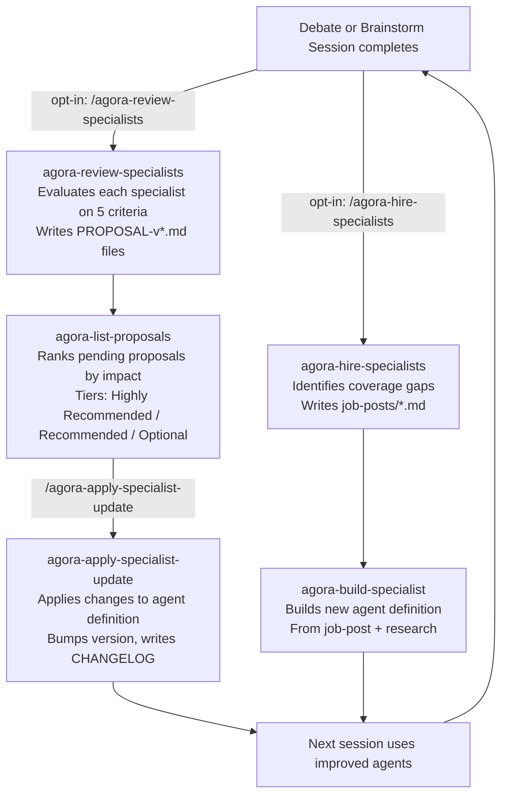
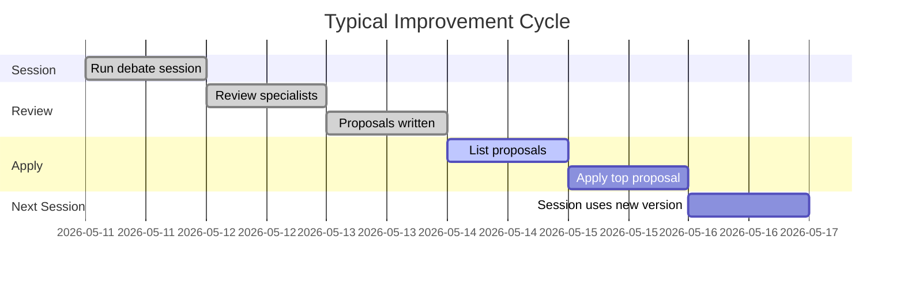

# Workflow: Continuous Improvement

The continuous improvement loop keeps specialist agents sharp over time. After sessions reveal performance gaps, proposals are written, reviewed, and applied — and new specialists can be hired to fill coverage holes.

---

## Loop Overview



Both post-session steps are **opt-in** — the session skill prints prompts but does not invoke them automatically. Skipping saves 27K–70K tokens per session.

---

## Step 1: Review Specialists

Triggered by: `/agora-review-specialists {slug}`

### What it evaluates

For each specialist in the session roster, reads their full contribution across all rounds and evaluates:

| Criterion | Score | What it measures |
|---|---|---|
| `adherence` | 1–5 | Did they follow their stated role and output structure? |
| `specificity` | 1–5 | Did they name real technologies, numbers, companies — not vague generalities? |
| `novelty` | 1–5 | Did they introduce new information each round vs. repeating prior points? |
| `responsiveness` | 1–5 | Did they acknowledge and build on what other specialists said? |
| `impact` | 1–5 | Did their contributions measurably raise any readiness dimension score? |

### Severity levels

| Level | Meaning | Action |
|---|---|---|
| `none` | Performed as expected | No proposal written |
| `minor` | Small improvements needed — tighter wording, better examples | Patch version bump |
| `moderate` | Behavior gap — not following part of instructions consistently | Minor version bump |
| `major` | Significant dysfunction across multiple rounds | Major version bump |

### Version bump types

| Type | Semver field | When to use |
|---|---|---|
| `patch` | Increment PATCH | Wording/phrasing only, no behavior change |
| `minor` | Increment MINOR, reset PATCH | Behavior changes, new guidance, added constraints |
| `major` | Increment MAJOR, reset MINOR+PATCH | Output format/structure changes that could break callers |

### Proposal file format

Written to `.claude/agents/{specialist-name}/PROPOSAL-v{next-version}.md`:

```yaml
---
specialist: specialist-growth
current-version: 1.1.0
proposed-version: 1.1.1
change-type: patch
session: ideas/flavour-graph/sessions/flavour-graph-session-3-20260511.md
date: 2026-05-11
status: pending
---
```

```markdown
## Proposed Changes to specialist-growth

### Summary
Specialist gave generic distribution advice without naming specific communities...

### Observed Issues
- **[minor]** Named "social media" instead of specific communities.
  *Evidence: Round 2 — "consider posting on social media and product forums"*

### Proposed Skill Changes

#### Change 1: Require specific community names

**Current instruction:**
```
Name specific channels and tactics.
```

**Proposed instruction:**
```
Name specific subreddits, newsletters, Slack/Discord communities, and indie hacker forums.
"social media" is never acceptable — replace with actual platform + community name.
```

**Rationale:** Forces the specialist to do the research, not just gesture at channels.

### Breaking Change Analysis
- **Breaking:** no
- **Affected specialists:** none
- **What breaks:** n/a

### Recommended Testing
Check that Round 1 growth response in next session names at least 2 specific communities with subscriber counts.
```

### Existing proposal handling

Before writing a new proposal file, the skill checks for existing pending proposals:
- If a `PROPOSAL-v*.md` with `status: pending` exists → **update it** rather than create a new one
- If the new analysis requires a higher change-type (e.g., patch → minor) → recompute version and rename file
- If `status: applied` → proceed to create a new proposal file

---

## Step 2: List Proposals

Triggered by: `/agora-list-proposals`

Scans all `.claude/agents/*/PROPOSAL-v*.md` files, computes an impact score for each pending proposal, and prints them in priority order.

### Impact scoring

| Factor | Points |
|---|---|
| change-type: patch | +1 |
| change-type: minor | +2 |
| change-type: major | +4 |
| Breaking: yes | +2 |
| Each affected downstream specialist (max 3) | +1 each |
| Each `[major]` issue (max 2) | +1 each |
| Each `[moderate]` issue (max 1) | +0.5 |
| Proposal 14+ days old (stale) | +0.5 |

Max score: 10

### Tiers

| Tier | Condition |
|---|---|
| Highly Recommended | Impact ≥ 5, OR major change-type, OR breaking |
| Recommended | Impact ≥ 3 |
| Optional | Everything else |

---

## Step 3: Apply Update

Triggered by: `/agora-apply-specialist-update {specialist-name}`

### What it does

1. Locates the pending `PROPOSAL-v*.md` for the named specialist
2. Validates that the agent's current version matches the proposal's `current-version`
3. For `major` changes: offers to run `/knowledge-architect` first for architecture review
4. Applies each proposed text change to the agent definition (exact string replacement)
5. Updates `version` in agent frontmatter
6. For breaking changes: offers cascade patch to affected specialists (auto-applies + patches their CHANGELOG)
7. Marks proposal `status: applied` + records `applied-date`
8. Writes or prepends to agent's `CHANGELOG.md`

### CHANGELOG format

```markdown
# Changelog — specialist-growth

## [1.1.1] — 2026-05-11

### Fixed
- Added explicit instruction to name specific subreddits when proposing distribution channels.

**Source:** Proposal `PROPOSAL-v1.1.1.md` — session `ideas/flavour-graph/sessions/...`

---

## [1.1.0] — 2026-05-08
...
```

### Architectural review gate

For `major` change-type proposals, the skill asks:

> "This is a major structural change. Would you like to validate the new design with /knowledge-architect before applying? (y/n)"

If yes: the user runs `/knowledge-architect` with the proposed changes as input, then returns to apply. This ensures structural changes are consistent with Anthropic architecture best practices.

---

## Step 4: Hire Specialists (Optional)

Triggered by: `/agora-hire-specialists {slug}`

After reviewing a session, the skill identifies **coverage gaps** — domains or perspectives that were missing from the roster and would have improved the session. It writes job-post files to `job-posts/` describing the role.

### Job post format

`job-posts/{role-slug}.md`:

```markdown
# Job Post: {Role Title}

## Why we need this specialist
{What gap was observed in the session — which dimension scores could this specialist improve?}

## Role description
{What this specialist would contribute to debate sessions}

## Expected output per turn
{Specific format and content requirements}

## Session coverage
{Which readiness dimensions this specialist primarily addresses}

## Selection criteria
{When should agora-lead-specialist pick this specialist over others?}
```

---

## Step 5: Build Specialist (Optional)

Triggered by: `/agora-build-specialist {slug}`

Reads the job post and builds a full agent definition:

1. Research the role domain (via WebSearch if needed)
2. Write `.claude/agents/specialist-{name}.md` with full system prompt
3. Create `.claude/agents/specialist-{name}/CHANGELOG.md` with initial entry
4. Register the specialist in `agora-lead-specialist` skill selection rules

---

## Improvement Cycle Timeline



---

## Version History Example

```
specialist-growth
├── v1.0.0  Initial definition
├── v1.1.0  Added week-by-week traction plan requirement (minor)
└── v1.1.1  Required specific community names (patch)

specialist-finance
├── v1.0.0  Initial definition
├── v1.1.0  Added gross margin >30% check (minor)
├── v1.2.0  Added per-phase budget breakdown format (minor)
```

---

## Key Design Constraints

- **One pending proposal per specialist at a time.** If a new review produces a proposal for an agent that already has one pending, the existing proposal is updated (not duplicated).
- **Major changes get an architecture review gate** — the apply skill asks before proceeding.
- **Breaking changes cascade.** If a specialist's output format changes (major bump), all specialists that consume that output receive automatic patch updates with appropriate CHANGELOG entries.
- **Memory vs. proposals.** Agents improve in two orthogonal ways: (a) their `MEMORY.md` accumulates cross-session patterns automatically every session; (b) their definition (system prompt) is updated via the formal proposal process. Memory is immediate and continuous; definition changes are deliberate and versioned.
